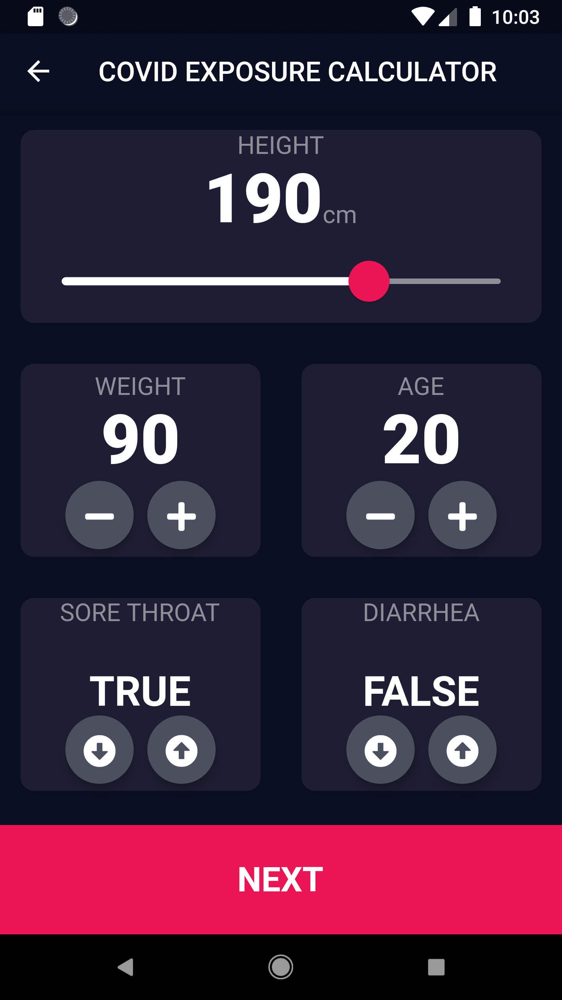
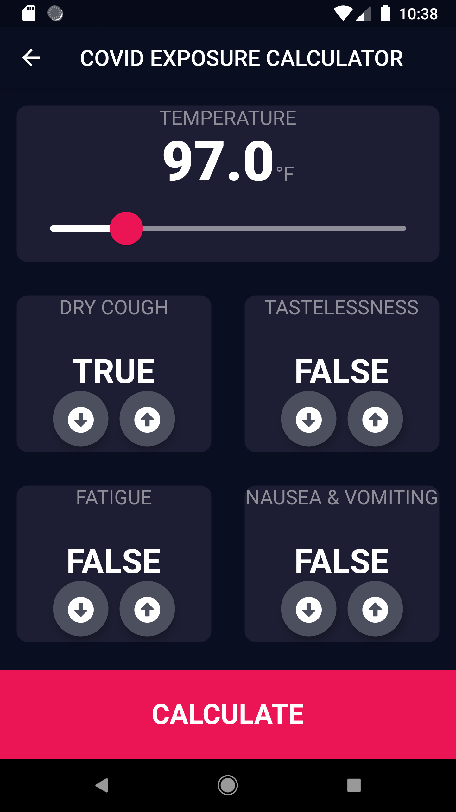
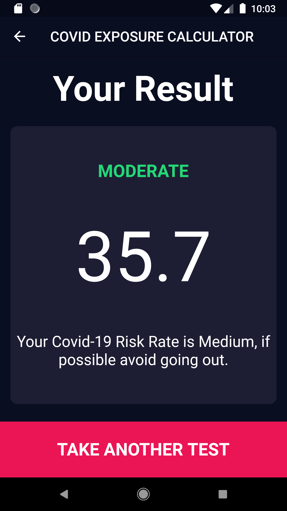

# PROJECT NAME : COVID RISK FACTOR CALCULATOR

## STARTING MONTH : FEBRUARY 2021
## ENDING MONTH : MARCH 2021

## STATUS: COMPLETED

### DESCRIPTION 

The COVID Risk Factor/Exposure Calculator is a small multiscreen test application that a user can take on themselves to check their risk of exposure percentage to COVID-19. The main aim of this application is just to tell if their is a chance of the person taking this test getting exposed to COVID-19. The factors used to actually calculate the result are taken from the official WHO website for COVID related FAQs.  

---

### RESULT CALCULATIONS

This application works on factors or symptoms given by WHO to assess someone's vulnerability to COVID-19. One new parameter that is added by me in this project is the Body Mass Index. To calculate the risk factor I have added a points system according to the priority of the symptoms. The symptoms used in the application are Fever, Dry Cough, Tastelessness, Fatigue, Nausea and Vomiting, Age, Diarrhea and BMI. A count is initialised to zero which increments everytime when the condition or symptom is true. Most of the symptoms are taken as booleans whereas for age and BMI an integer and double type is used. There is a plus two to maxiumum value of count which is used to calculate the percentage of risk factor. The results are also shown according to the range defined for three possibilities low, moderate and high.  

---

### APPLICATION VIEW

  

 

 

---

### LIMITATIONS AND FUTURE SCOPE

- Currently a prototype application with not many test cases performed.
- Not perfectly bug proof, some bugs can be exploited due to lack of testing.
- In future, some API calls can be added such as vaccination centers and current cases in the region with geolocator if the situation exists.
- The efficiency of the algorithm can be highly improved by inversing it.
- Some more factors can be added to the calculation system for new strains also.

---

### PROBLEMS EXPERIENCED DURING DEVELOPMENT

- Sending the inputs from first input screen to the results page directly without neglecting the second screen information.
- Positioning of widgets as dart is not as much as flexible to position content structure as web development.
- Extending different methods for Body Mass Index and COVID-19 symptoms for result calculation. 

